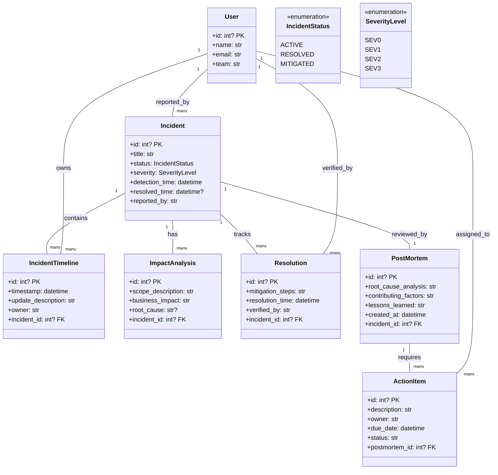

```mermaid

classDiagram

    class Incident {
      +id: int? PK
      +title: str
      +status: IncidentStatus
      +severity: SeverityLevel
      +detection_time: datetime
      +resolved_time: datetime?
      +reported_by: str
    }

    class IncidentTimeline {
        +id: int? PK
        +timestamp: datetime
        +update_description: str
        +owner: str
        +incident_id: int? FK
    }

    class ImpactAnalysis {
        +id: int? PK
        +scope_description: str
        +business_impact: str
        +root_cause: str?
        +incident_id: int? FK
    }

    class Resolution {
        +id: int? PK
        +mitigation_steps: str
        +resolution_time: datetime
        +verified_by: str
        +incident_id: int? FK
    }

    class PostMortem {
        +id: int? PK
        +root_cause_analysis: str
        +contributing_factors: str
        +lessons_learned: str
        +created_at: datetime
        +incident_id: int? FK
    }

    class ActionItem {
        +id: int? PK
        +description: str
        +owner: str
        +due_date: datetime
        +status: str
        +postmortem_id: int? FK
    }

    class User {
        +id: int? PK
        +name: str
        +email: str
        +team: str
    }

    class IncidentStatus {
        <<enumeration>>
        ACTIVE
        RESOLVED
        MITIGATED
    }

    class SeverityLevel {
        <<enumeration>>
        SEV0
        SEV1
        SEV2
        SEV3
    }

    Incident "1" -- "many" IncidentTimeline : contains
    Incident "1" -- "many" ImpactAnalysis : has
    Incident "1" -- "many" Resolution : tracks
    Incident "1" -- "1" PostMortem : reviewed_by
    PostMortem "1" -- "many" ActionItem : requires
    User "1" -- "many" Incident : reported_by
    User "1" -- "many" IncidentTimeline : owns
    User "1" -- "many" Resolution : verified_by
    User "1" -- "many" ActionItem : assigned_to
```
