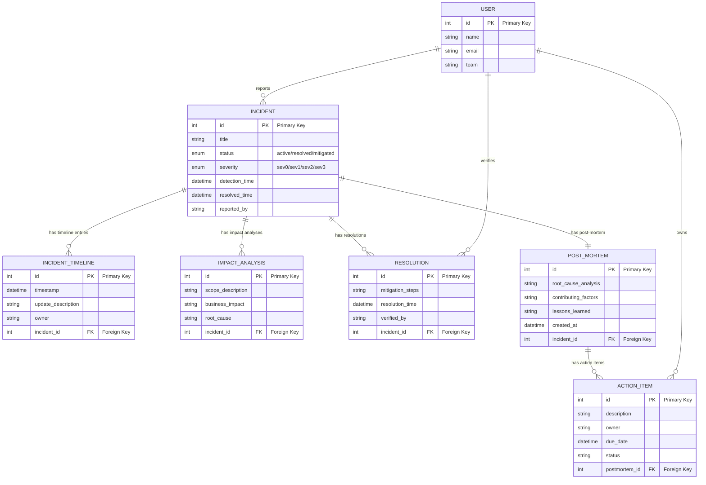

```mermaid

erDiagram
USER {
int id PK "Primary Key"
string name
string email
string team
}

    INCIDENT {
        int id PK "Primary Key"
        string title
        enum status "active/resolved/mitigated"
        enum severity "sev0/sev1/sev2/sev3"
        datetime detection_time
        datetime resolved_time
        string reported_by
    }

    INCIDENT_TIMELINE {
        int id PK "Primary Key"
        datetime timestamp
        string update_description
        string owner
        int incident_id FK "Foreign Key"
    }

    IMPACT_ANALYSIS {
        int id PK "Primary Key"
        string scope_description
        string business_impact
        string root_cause
        int incident_id FK "Foreign Key"
    }

    RESOLUTION {
        int id PK "Primary Key"
        string mitigation_steps
        datetime resolution_time
        string verified_by
        int incident_id FK "Foreign Key"
    }

    POST_MORTEM {
        int id PK "Primary Key"
        string root_cause_analysis
        string contributing_factors
        string lessons_learned
        datetime created_at
        int incident_id FK "Foreign Key"
    }

    ACTION_ITEM {
        int id PK "Primary Key"
        string description
        string owner
        datetime due_date
        string status
        int postmortem_id FK "Foreign Key"
    }

    USER ||--o{ INCIDENT : reports
    INCIDENT ||--o{ INCIDENT_TIMELINE : "has timeline entries"
    INCIDENT ||--o{ IMPACT_ANALYSIS : "has impact analyses"
    INCIDENT ||--o{ RESOLUTION : "has resolutions"
    INCIDENT ||--|| POST_MORTEM : "has post-mortem"
    POST_MORTEM ||--o{ ACTION_ITEM : "has action items"
    USER ||--o{ ACTION_ITEM : "owns"
    USER ||--o{ RESOLUTION : "verifies"
```
