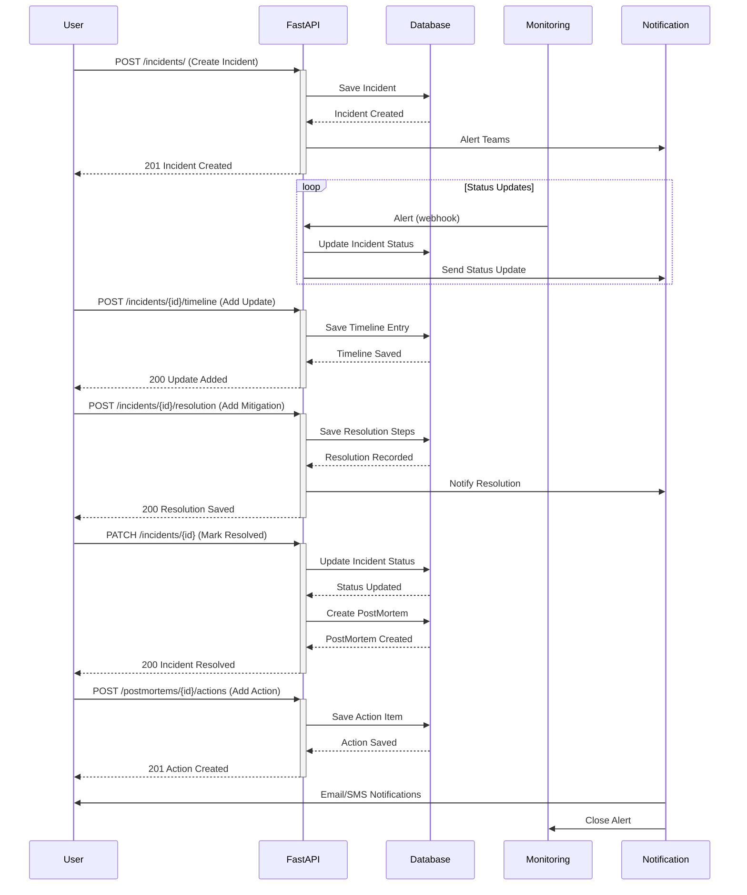

```mermaid
sequenceDiagram
participant User
participant FastAPI
participant Database
participant Monitoring
participant Notification

    User->>+FastAPI: POST /incidents/ (Create Incident)
    FastAPI->>Database: Save Incident
    Database-->>FastAPI: Incident Created
    FastAPI->>Notification: Alert Teams
    FastAPI-->>-User: 201 Incident Created

    loop Status Updates
        Monitoring->>FastAPI: Alert (webhook)
        FastAPI->>Database: Update Incident Status
        FastAPI->>Notification: Send Status Update
    end

    User->>+FastAPI: POST /incidents/{id}/timeline (Add Update)
    FastAPI->>Database: Save Timeline Entry
    Database-->>FastAPI: Timeline Saved
    FastAPI-->>-User: 200 Update Added

    User->>+FastAPI: POST /incidents/{id}/resolution (Add Mitigation)
    FastAPI->>Database: Save Resolution Steps
    Database-->>FastAPI: Resolution Recorded
    FastAPI->>Notification: Notify Resolution
    FastAPI-->>-User: 200 Resolution Saved

    User->>+FastAPI: PATCH /incidents/{id} (Mark Resolved)
    FastAPI->>Database: Update Incident Status
    Database-->>FastAPI: Status Updated
    FastAPI->>Database: Create PostMortem
    Database-->>FastAPI: PostMortem Created
    FastAPI-->>-User: 200 Incident Resolved

    User->>+FastAPI: POST /postmortems/{id}/actions (Add Action)
    FastAPI->>Database: Save Action Item
    Database-->>FastAPI: Action Saved
    FastAPI-->>-User: 201 Action Created

    Notification->>User: Email/SMS Notifications
    Notification->>Monitoring: Close Alert
```
