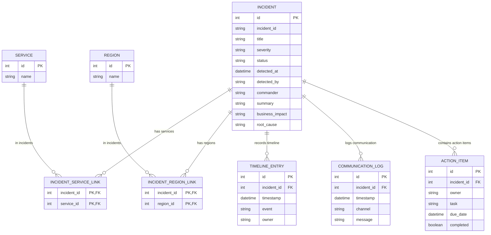

```mermaid

erDiagram
    INCIDENT {
        int id PK
        string incident_id
        string title
        string severity
        string status
        datetime detected_at
        string detected_by
        string commander
        string summary
        string business_impact
        string root_cause
    }
    SERVICE {
        int id PK
        string name
    }
    REGION {
        int id PK
        string name
    }
    INCIDENT_SERVICE_LINK {
        int incident_id PK, FK
        int service_id  PK, FK
    }
    INCIDENT_REGION_LINK {
        int incident_id PK, FK
        int region_id   PK, FK
    }
    TIMELINE_ENTRY {
        int id PK
        int incident_id FK
        datetime timestamp
        string event
        string owner
    }
    COMMUNICATION_LOG {
        int id PK
        int incident_id FK
        datetime timestamp
        string channel
        string message
    }
    ACTION_ITEM {
        int id PK
        int incident_id FK
        string owner
        string task
        datetime due_date
        boolean completed
    }

    INCIDENT ||--o{ INCIDENT_SERVICE_LINK : "has services"
    SERVICE  ||--o{ INCIDENT_SERVICE_LINK : "in incidents"

    INCIDENT ||--o{ INCIDENT_REGION_LINK  : "has regions"
    REGION   ||--o{ INCIDENT_REGION_LINK  : "in incidents"

    INCIDENT ||--o{ TIMELINE_ENTRY        : "records timeline"
    INCIDENT ||--o{ COMMUNICATION_LOG     : "logs communication"
    INCIDENT ||--o{ ACTION_ITEM           : "contains action items"

```
