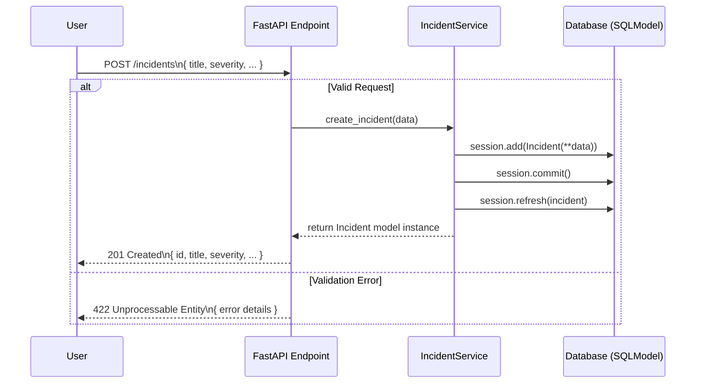

```mermaid

sequenceDiagram
participant User
participant HTTP as FastAPI Endpoint
participant Service as IncidentService
participant DB as Database (SQLModel)

    User->>HTTP: POST /incidents\n{ title, severity, ... }
    alt Valid Request
        HTTP->>Service: create_incident(data)
        Service->>DB: session.add(Incident(**data))
        Service->>DB: session.commit()
        Service->>DB: session.refresh(incident)
        Service-->>HTTP: return Incident model instance
        HTTP-->>User: 201 Created\n{ id, title, severity, ... }
    else Validation Error
        HTTP-->>User: 422 Unprocessable Entity\n{ error details }
    end

```
