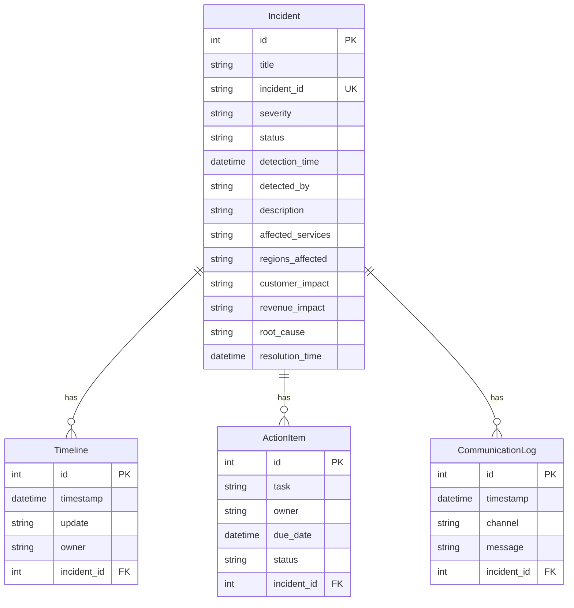

```mermaid

erDiagram
    Incident ||--o{ Timeline : has
    Incident ||--o{ ActionItem : has
    Incident ||--o{ CommunicationLog : has

    Incident {
        int id PK
        string title
        string incident_id UK
        string severity
        string status
        datetime detection_time
        string detected_by
        string description
        string affected_services
        string regions_affected
        string customer_impact
        string revenue_impact
        string root_cause
        datetime resolution_time
    }

    Timeline {
        int id PK
        datetime timestamp
        string update
        string owner
        int incident_id FK
    }

    ActionItem {
        int id PK
        string task
        string owner
        datetime due_date
        string status
        int incident_id FK
    }

    CommunicationLog {
        int id PK
        datetime timestamp
        string channel
        string message
        int incident_id FK
    }
```
