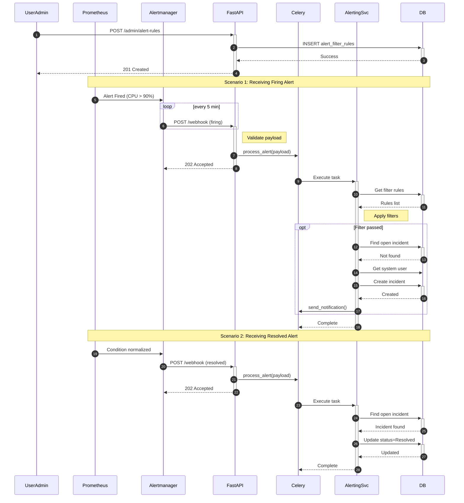

```mermaid
sequenceDiagram
    autonumber
    participant UserAdmin
    participant Prometheus
    participant Alertmanager
    participant FastAPI
    participant Celery
    participant AlertingSvc
    participant DB

    UserAdmin->>+FastAPI: POST /admin/alert-rules
    FastAPI->>+DB: INSERT alert_filter_rules
    DB-->>-FastAPI: Success
    FastAPI-->>-UserAdmin: 201 Created

    Note over Prometheus,DB: Scenario 1: Receiving Firing Alert

    Prometheus->>Alertmanager: Alert Fired (CPU > 90%)
    loop every 5 min
        Alertmanager->>+FastAPI: POST /webhook (firing)
    end
    Note right of FastAPI: Validate payload
    FastAPI->>Celery: process_alert(payload)
    FastAPI-->>-Alertmanager: 202 Accepted

    Celery->>+AlertingSvc: Execute task
    AlertingSvc->>+DB: Get filter rules
    DB-->>-AlertingSvc: Rules list

    Note right of AlertingSvc: Apply filters

    opt Filter passed
        AlertingSvc->>+DB: Find open incident
        DB-->>-AlertingSvc: Not found
        AlertingSvc->>DB: Get system user
        AlertingSvc->>+DB: Create incident
        DB-->>-AlertingSvc: Created
        AlertingSvc->>Celery: send_notification()
        end

    AlertingSvc-->>-Celery: Complete

    Note over Prometheus,DB: Scenario 2: Receiving Resolved Alert

    Prometheus->>Alertmanager: Condition normalized
    Alertmanager->>+FastAPI: POST /webhook (resolved)
    FastAPI->>Celery: process_alert(payload)
    FastAPI-->>-Alertmanager: 202 Accepted

    Celery->>+AlertingSvc: Execute task
    AlertingSvc->>+DB: Find open incident
    DB-->>-AlertingSvc: Incident found
    AlertingSvc->>+DB: Update status=Resolved
    DB-->>-AlertingSvc: Updated
    AlertingSvc-->>-Celery: Complete
```
