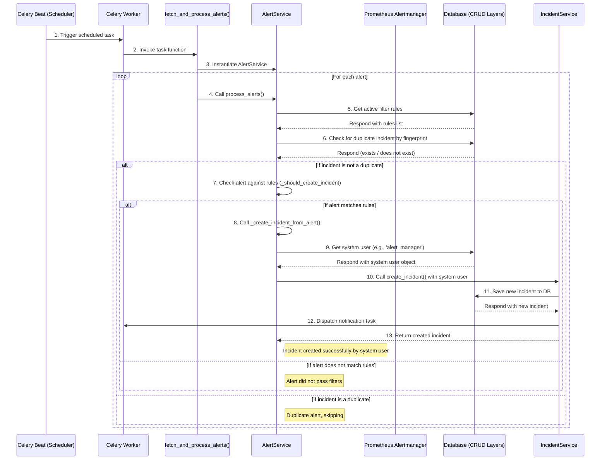

```mermaid
sequenceDiagram
    participant CeleryBeat as Celery Beat (Scheduler)
    participant CeleryWorker as Celery Worker
    participant AlertTask as fetch_and_process_alerts()
    participant AlertService as AlertService
    participant Alertmanager as Prometheus Alertmanager
    participant Database as Database (CRUD Layers)
    participant IncidentService as IncidentService

    CeleryBeat->>CeleryWorker: 1. Trigger scheduled task
    CeleryWorker->>AlertTask: 2. Invoke task function

    AlertTask->>AlertService: 3. Instantiate AlertService

    loop For each alert
        AlertTask->>AlertService: 4. Call process_alerts()
        AlertService->>Database: 5. Get active filter rules
        Database-->>AlertService: Respond with rules list

        AlertService->>Database: 6. Check for duplicate incident by fingerprint
        Database-->>AlertService: Respond (exists / does not exist)

        alt If incident is not a duplicate
            AlertService->>AlertService: 7. Check alert against rules (_should_create_incident)

            alt If alert matches rules
                AlertService->>AlertService: 8. Call _create_incident_from_alert()
                AlertService->>Database: 9. Get system user (e.g., 'alert_manager')
                Database-->>AlertService: Respond with system user object

                AlertService->>IncidentService: 10. Call create_incident() with system user
                IncidentService->>Database: 11. Save new incident to DB
                Database-->>IncidentService: Respond with new incident
                IncidentService->>CeleryWorker: 12. Dispatch notification task
                IncidentService-->>AlertService: 13. Return created incident

                Note right of AlertService: Incident created successfully by system user
            else If alert does not match rules
                Note right of AlertService: Alert did not pass filters
            end
        else If incident is a duplicate
             Note right of AlertService: Duplicate alert, skipping
        end
    end
```
