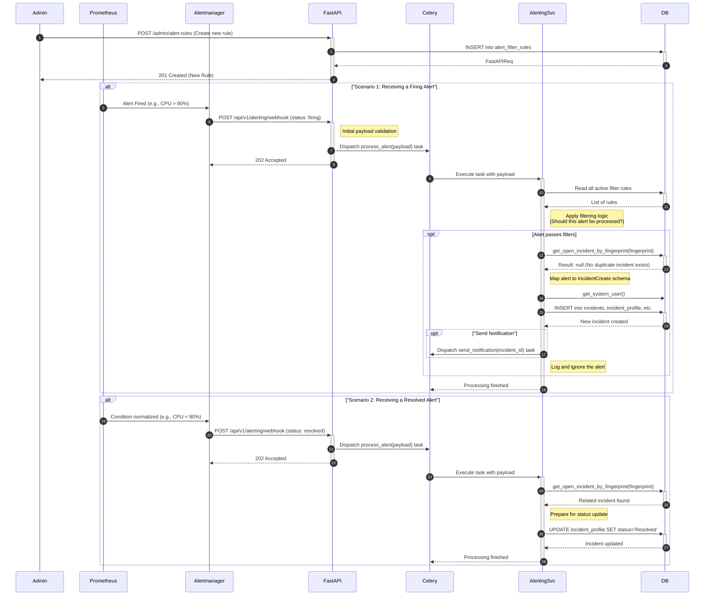

```mermaid
sequenceDiagram
    autonumber
    participant Admin
    participant Prometheus
    participant Alertmanager
    participant FastAPI
    participant Celery
    participant AlertingSvc
    participant DB

    Admin->>+FastAPI: POST /admin/alert-rules (Create new rule)
    FastAPI->>+DB: INSERT into alert_filter_rules
    DB-->>-FastAPI: FastAPIReq
    FastAPI-->>-Admin: 201 Created (New Rule)

    %% ======================= Scenario 1: New Firing Alert =======================
    alt "Scenario 1: Receiving a Firing Alert"
        Prometheus->>Alertmanager: Alert Fired (e.g., CPU > 90%)
        Alertmanager->>+FastAPI: POST /api/v1/alerting/webhook (status: firing)
        Note right of FastAPI: Initial payload validation
        FastAPI->>Celery: Dispatch process_alert(payload) task
        FastAPI-->>-Alertmanager: 202 Accepted

        Celery->>+AlertingSvc: Execute task with payload
        AlertingSvc->>+DB: Read all active filter rules
        DB-->>-AlertingSvc: List of rules
        Note right of AlertingSvc: Apply filtering logic<br/>(Should this alert be processed?)

        opt Alert passes filters
            AlertingSvc->>+DB: get_open_incident_by_fingerprint(fingerprint)
            DB-->>-AlertingSvc: Result: null (No duplicate incident exists)

            Note right of AlertingSvc: Map alert to IncidentCreate schema
            AlertingSvc->>DB: get_system_user()
            AlertingSvc->>+DB: INSERT into incidents, incident_profile, etc.
            DB-->>-AlertingSvc: New incident created

            opt "Send Notification"
                AlertingSvc->>Celery: Dispatch send_notification(incident_id) task
            end
             Note right of AlertingSvc: Log and ignore the alert
        end
        AlertingSvc-->>-Celery: Processing finished

    end

    %% ======================= Scenario 2: Resolved Alert =======================
    alt "Scenario 2: Receiving a Resolved Alert"
        Prometheus->>Alertmanager: Condition normalized (e.g., CPU < 90%)
        Alertmanager->>+FastAPI: POST /api/v1/alerting/webhook (status: resolved)
        FastAPI->>Celery: Dispatch process_alert(payload) task
        FastAPI-->>-Alertmanager: 202 Accepted

        Celery->>+AlertingSvc: Execute task with payload
        AlertingSvc->>+DB: get_open_incident_by_fingerprint(fingerprint)
        DB-->>-AlertingSvc: Related incident found

        Note right of AlertingSvc: Prepare for status update
        AlertingSvc->>+DB: UPDATE incident_profile SET status='Resolved'
        DB-->>-AlertingSvc: Incident updated

        AlertingSvc-->>-Celery: Processing finished
    end
```
