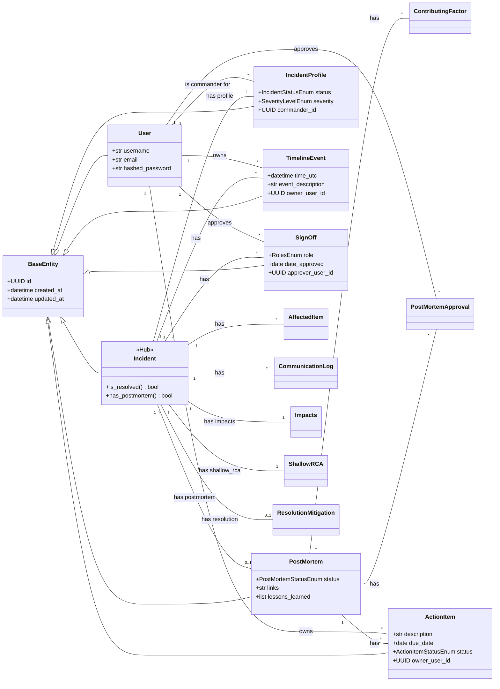

```mermaid
classDiagram
    direction LR

    class BaseEntity {
        +UUID id
        +datetime created_at
        +datetime updated_at
    }

    class User {
        +str username
        +str email
        +str hashed_password
    }
    BaseEntity <|-- User

    class Incident {
        <<Hub>>
        +is_resolved() bool
        +has_postmortem() bool
    }
    BaseEntity <|-- Incident

    class PostMortem {
        +PostMortemStatusEnum status
        +str links
        +list lessons_learned
    }
    BaseEntity <|-- PostMortem

    class IncidentProfile {
        +IncidentStatusEnum status
        +SeverityLevelEnum severity
        +UUID commander_id
    }
    BaseEntity <|-- IncidentProfile

    class TimelineEvent {
        +datetime time_utc
        +str event_description
        +UUID owner_user_id
    }
    BaseEntity <|-- TimelineEvent

    class ActionItem {
        +str description
        +date due_date
        +ActionItemStatusEnum status
        +UUID owner_user_id
    }
    BaseEntity <|-- ActionItem

    class SignOff {
        +RolesEnum role
        +date date_approved
        +UUID approver_user_id
    }
    BaseEntity <|-- SignOff

    %% Relationships

    Incident "1" -- "1" IncidentProfile : has profile
    Incident "1" -- "0..1" PostMortem : has postmortem

    Incident "1" -- "*" AffectedItem : has
    Incident "1" -- "*" TimelineEvent : has
    Incident "1" -- "*" CommunicationLog : has
    Incident "1" -- "*" SignOff : has

    Incident "1" -- "1" Impacts : has impacts
    Incident "1" -- "1" ShallowRCA : has shallow_rca
    Incident "1" -- "0..1" ResolutionMitigation : has resolution

    PostMortem "1" -- "*" ContributingFactor : has
    PostMortem "1" -- "*" ActionItem : has
    PostMortem "1" -- "*" PostMortemApproval : has

    User "1" -- "*" IncidentProfile : is commander for
    User "1" -- "*" TimelineEvent : owns
    User "1" -- "*" ActionItem : owns
    User "1" -- "*" SignOff : approves
    User "1" -- "*" PostMortemApproval : approves
```
