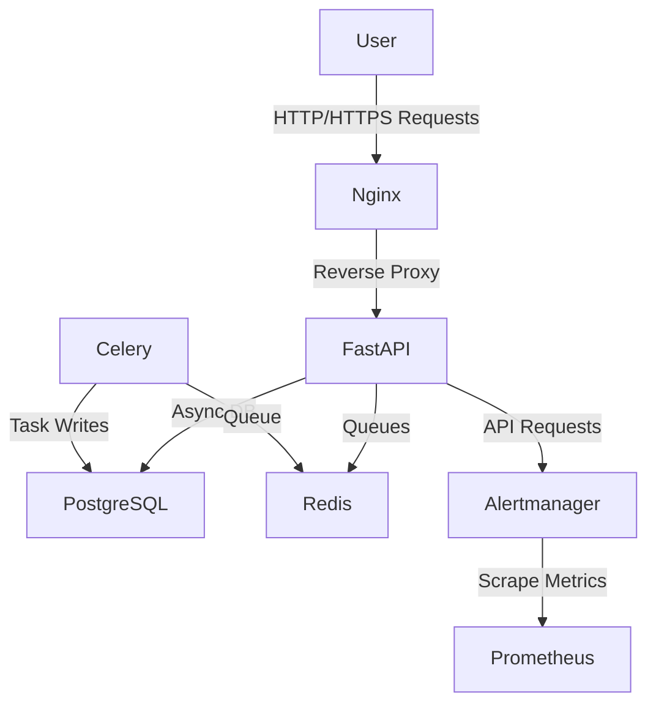

```mermaid

graph TD
User    --> |HTTP/HTTPS Requests| Nginx
Nginx   --> |Reverse Proxy| FastAPI
FastAPI --> |Async DB| PostgreSQL
FastAPI --> |Queues| Redis
FastAPI --> |API Requests| Alertmanager
Celery -->|Queue| Redis
Celery -->|Task Writes| PostgreSQL
Alertmanager -->|Scrape Metrics| Prometheus

```
