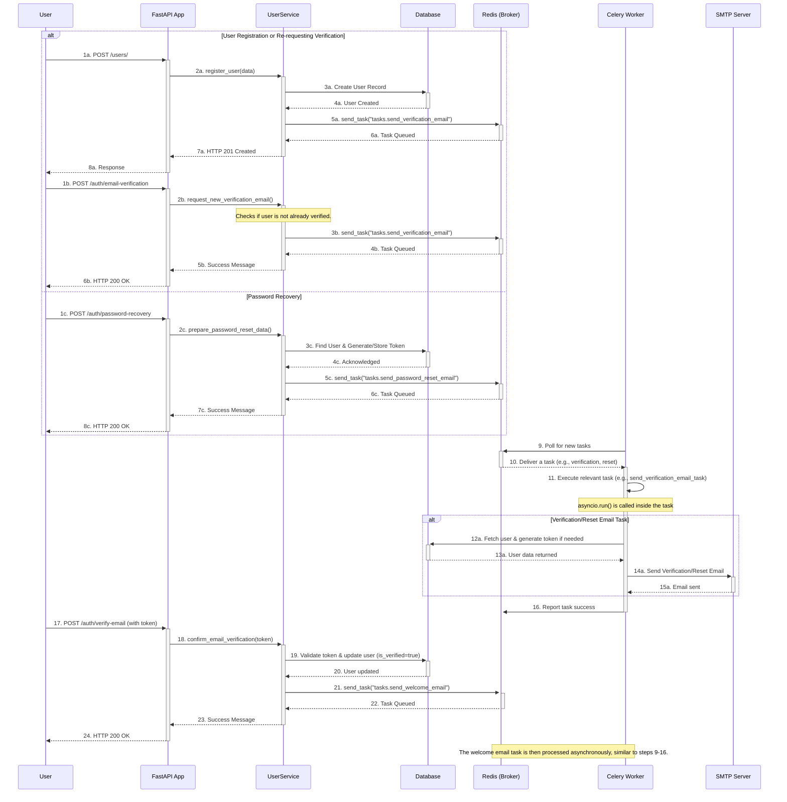

```mermaid
sequenceDiagram
participant User
participant FastAPI App
participant UserService
participant Database
participant Redis (Broker)
participant Celery Worker
participant SMTP Server

    alt User Registration or Re-requesting Verification

        %% Flow 1: New User Registration
        User->>+FastAPI App: 1a. POST /users/
        FastAPI App->>+UserService: 2a. register_user(data)
        UserService->>+Database: 3a. Create User Record
        Database-->>-UserService: 4a. User Created
        UserService->>+Redis (Broker): 5a. send_task("tasks.send_verification_email")
        Redis (Broker)-->>-UserService: 6a. Task Queued
        UserService-->>-FastAPI App: 7a. HTTP 201 Created
        FastAPI App-->>-User: 8a. Response

        %% Flow 2: Re-requesting Verification Email
        User->>+FastAPI App: 1b. POST /auth/email-verification
        FastAPI App->>+UserService: 2b. request_new_verification_email()
        Note over UserService: Checks if user is not already verified.
        UserService->>+Redis (Broker): 3b. send_task("tasks.send_verification_email")
        Redis (Broker)-->>-UserService: 4b. Task Queued
        UserService-->>-FastAPI App: 5b. Success Message
        FastAPI App-->>-User: 6b. HTTP 200 OK

    else Password Recovery

        %% Flow 3: Password Recovery Request
        User->>+FastAPI App: 1c. POST /auth/password-recovery
        FastAPI App->>+UserService: 2c. prepare_password_reset_data()
        UserService->>+Database: 3c. Find User & Generate/Store Token
        Database-->>-UserService: 4c. Acknowledged
        UserService->>+Redis (Broker): 5c. send_task("tasks.send_password_reset_email")
        Redis (Broker)-->>-UserService: 6c. Task Queued
        UserService-->>-FastAPI App: 7c. Success Message
        FastAPI App-->>-User: 8c. HTTP 200 OK

    end

    %% --- Common Asynchronous Flow for Email Sending ---

    Celery Worker->>+Redis (Broker): 9. Poll for new tasks
    Redis (Broker)-->>-Celery Worker: 10. Deliver a task (e.g., verification, reset)

    activate Celery Worker
    Celery Worker->>Celery Worker: 11. Execute relevant task (e.g., send_verification_email_task)
    Note over Celery Worker: asyncio.run() is called inside the task

    alt Verification/Reset Email Task
        Celery Worker->>+Database: 12a. Fetch user & generate token if needed
        Database-->>-Celery Worker: 13a. User data returned
        Celery Worker->>+SMTP Server: 14a. Send Verification/Reset Email
        SMTP Server-->>-Celery Worker: 15a. Email sent
    end

    Celery Worker->>+Redis (Broker): 16. Report task success
    deactivate Celery Worker

    %% --- Welcome Email Flow (triggered by verification) ---

    User->>+FastAPI App: 17. POST /auth/verify-email (with token)
    FastAPI App->>+UserService: 18. confirm_email_verification(token)
    UserService->>+Database: 19. Validate token & update user (is_verified=true)
    Database-->>-UserService: 20. User updated
    UserService->>+Redis (Broker): 21. send_task("tasks.send_welcome_email")
    Redis (Broker)-->>-UserService: 22. Task Queued
    UserService-->>-FastAPI App: 23. Success Message
    FastAPI App-->>-User: 24. HTTP 200 OK

    Note over Redis (Broker), Celery Worker: The welcome email task is then processed asynchronously, similar to steps 9-16.
```
