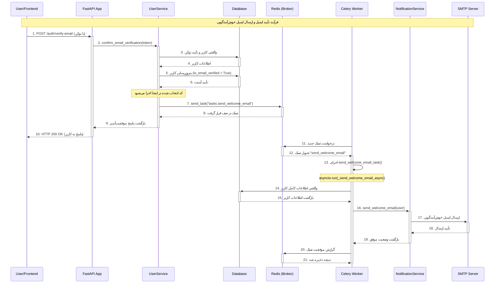

```mermaid

sequenceDiagram
participant User/Frontend
participant FastAPI App
participant UserService
participant Database
participant Redis (Broker)
participant Celery Worker
participant NotificationService
participant SMTP Server

    Note over User/Frontend, SMTP Server: فرآیند تأیید ایمیل و ارسال ایمیل خوش‌آمدگویی

    %% Part 1: User verifies email (Synchronous Flow)
    User/Frontend->>+FastAPI App: 1. POST /auth/verify-email (با توکن)
    FastAPI App->>+UserService: 2. confirm_email_verification(token)
    UserService->>+Database: 3. واکشی کاربر و تأیید توکن
    Database-->>-UserService: 4. اطلاعات کاربر
    UserService->>+Database: 5. به‌روزرسانی کاربر (is_email_verified = True)
    Database-->>-UserService: 6. تأیید آپدیت

    Note over UserService: کد انتخاب شده در اینجا اجرا می‌شود
    UserService->>+Redis (Broker): 7. send_task("tasks.send_welcome_email")
    Redis (Broker)-->>-UserService: 8. تسک در صف قرار گرفت

    UserService-->>-FastAPI App: 9. بازگشت پاسخ موفقیت‌آمیز
    FastAPI App-->>-User/Frontend: 10. HTTP 200 OK (پاسخ به کاربر)

    %% Part 2: Celery processes the task (Asynchronous Flow)
    Celery Worker->>+Redis (Broker): 11. درخواست تسک جدید
    Redis (Broker)-->>-Celery Worker: 12. تحویل تسک "send_welcome_email"

    activate Celery Worker
    Celery Worker->>Celery Worker: 13. اجرای send_welcome_email_task()
    Note over Celery Worker: asyncio.run(_send_welcome_email_async)

    Celery Worker->>+Database: 14. واکشی اطلاعات کامل کاربر
    Database-->>-Celery Worker: 15. بازگشت اطلاعات کاربر

    Celery Worker->>+NotificationService: 16. send_welcome_email(user)
    NotificationService->>+SMTP Server: 17. ارسال ایمیل خوش‌آمدگویی
    SMTP Server-->>-NotificationService: 18. تأیید ارسال
    NotificationService-->>-Celery Worker: 19. بازگشت وضعیت موفق

    Celery Worker->>+Redis (Broker): 20. گزارش موفقیت تسک
    Redis (Broker)-->>-Celery Worker: 21. نتیجه ذخیره شد
    deactivate Celery Worker
```
