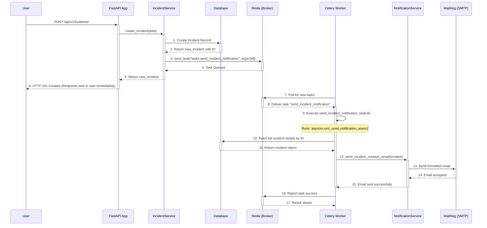

```mermaid
sequenceDiagram
    participant User
    participant FastAPI App
    participant IncidentService
    participant Database
    participant Redis (Broker)
    participant Celery Worker
    participant NotificationService
    participant MailHog (SMTP)

    %% --- Synchronous Part: User Request ---
    User->>+FastAPI App: POST /api/v1/incidents/
    FastAPI App->>+IncidentService: create_incident(data)
    IncidentService->>+Database: 1. Create Incident Record
    Database-->>-IncidentService: 2. Return new_incident with ID

    %% --- Enqueue Task (Still Synchronous but fast) ---
    IncidentService->>+Redis (Broker): 3. send_task("tasks.send_incident_notification", args=[id])
    Redis (Broker)-->>-IncidentService: 4. Task Queued

    IncidentService-->>-FastAPI App: 5. Return new_incident
    FastAPI App-->>-User: 6. HTTP 201 Created (Response sent to user immediately)

    %% --- Asynchronous Part: Background Worker ---
    Celery Worker->>+Redis (Broker): 7. Poll for new tasks
    Redis (Broker)-->>-Celery Worker: 8. Deliver task "send_incident_notification"

    activate Celery Worker
    Celery Worker->>Celery Worker: 9. Execute send_incident_notification_task(id)
    Note over Celery Worker: Runs `asyncio.run(_send_notification_async)`

    Celery Worker->>+Database: 10. Fetch full incident details by ID
    Database-->>-Celery Worker: 11. Return incident object

    Celery Worker->>+NotificationService: 12. send_incident_creation_email(incident)
    NotificationService->>+MailHog (SMTP): 13. Send formatted email
    MailHog (SMTP)-->>-NotificationService: 14. Email accepted
    NotificationService-->>-Celery Worker: 15. Email sent successfully
    deactivate Celery Worker

    Celery Worker->>+Redis (Broker): 16. Report task success
    Redis (Broker)-->>-Celery Worker: 17. Result stored

```
